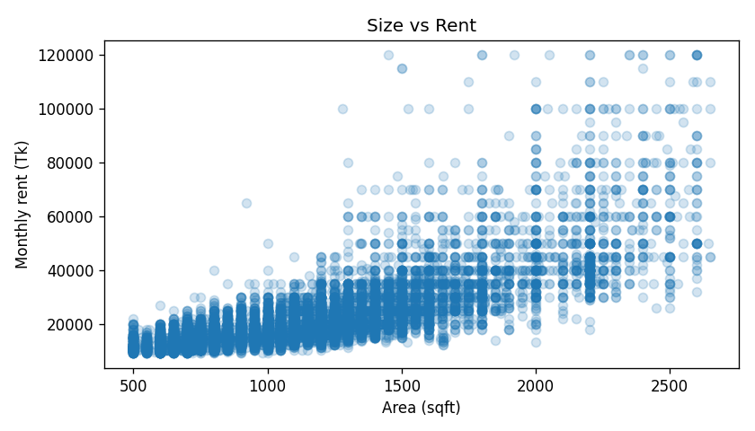
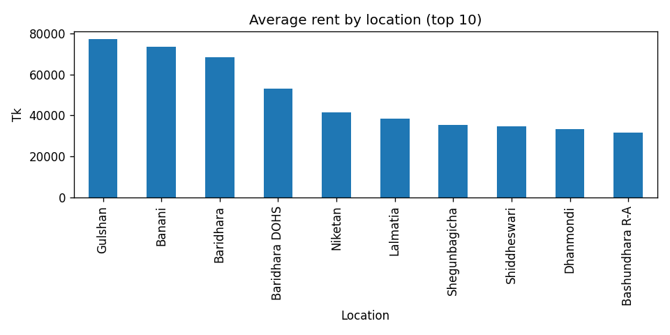
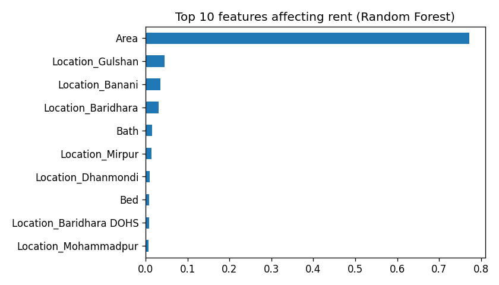
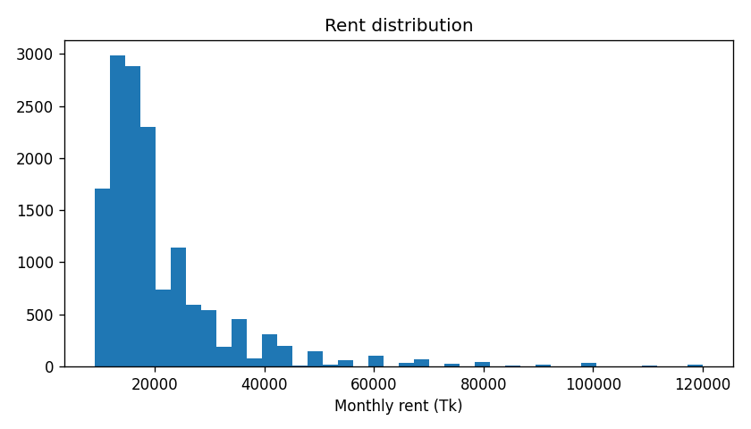

# Dhaka House Rent Predictor

A machine learning project that predicts monthly house rent in Dhaka from size, bedrooms, bathrooms and location, with a live web app.

**Live demo:** https://dhaka-rent-predictor.streamlit.app/

## Problem
Dhaka te onek manush bhara bari te thake, kintu fair bhara koto hoa uchit seta bujhar shohoj upay nai. Ei project listing data theke bhara estimate kore.

## Data
- Source: Kaggle "Dhaka House Rent" dataset (bproperty.com theke scrape kora) - https://www.kaggle.com/datasets/taeefnajib/house-rent-in-dhaka-city
- Rows: 28,800 original; 13,541 hubohu duplicate row remove kora hoy, outlier (choto/boro 1% rent ar area) bad dewar por 14,711 row e model train hoy
- Columns: Location, Area (sqft), Bed, Bath, Price (monthly rent)

## Approach
1. **Cleaning:** "65 Thousand" / "1.5 Lakh" ke number e convert, "sqft" ar comma remove, Location theke area er nam ber kora, duplicate ar missing row bad, shobcheye choto/boro 1% rent ar area (outlier) bad.
2. **Features:** Area, Bed, Bath + Location (One-Hot Encoding). Kom listing wala location "Other" e merge.
3. **Models:** Linear Regression vs Random Forest vs Gradient Boosting, 80/20 train-test split.
4. **App:** Streamlit diye user input theke live prediction.

## Results
Test set (20% data) er upor:

| Model | MAE (Tk) | RMSE (Tk) | R2 |
|---|---|---|---|
| Linear Regression | 3,539 | 5,929 | 0.801 |
| Random Forest | 3,349 | 5,783 | 0.811 |
| Gradient Boosting | 3,282 | 5,626 | 0.821 |

Gradient Boosting shobcheye bhalo, average error proay 3,300 taka/month. Tobe Linear Regression o kachakachi (R2 0.80), mane size ar location diyei bhara er onek ta bojha jay.

Charts: `charts/` folder e (

 
).

## Limitations
- Eta listing rent, actual agreed rent na.
- Floor, lift, parking, building age er moto detail nai.
- Data ekta website theke scrape kora, tai shob area cover kore na.
- Bhara shomoy er shathe bodlay, data purono hote pare.

## How to run
```
pip install -r requirements.txt
python train.py
streamlit run app.py
```
